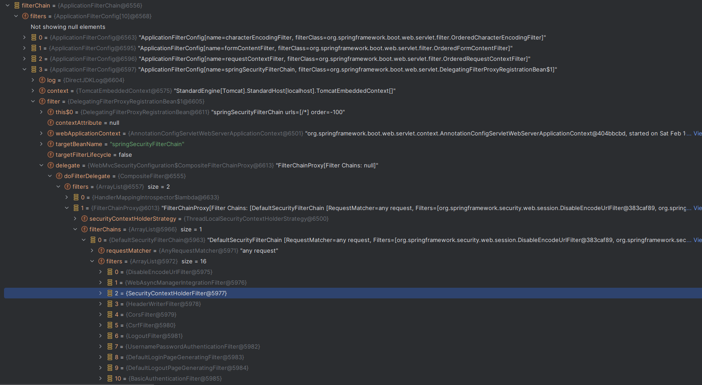
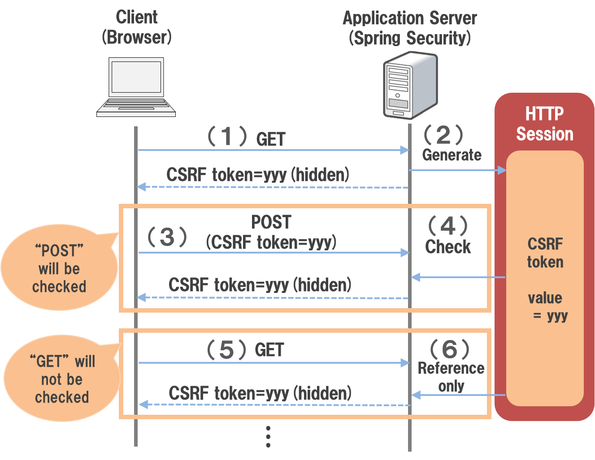

SpringSecurity


https://qiita.com/opengl-8080/items/7c34053c74448d39e8f5

https://qiita.com/opengl-8080/items/6dc37f8b77abb5ae1642


TODO:　HTTPS　Cookie　Http


# 1. 概要  

## 1.1 物語の起源

- 社内セキュリティガイドラインがあり、古くて。最新完了したプロジェクトはSpringSecurtyを利用して。どこまで利用できるか検証しながらガイドラインを作成

  - SpringFrameworkの一員として提供されている。`org.springframework.boot:spring-boot-starter-security`という依存関係を追加することで適用される
  - 提供機能
    - 認証
      - アプリケーションを利用するユーザーの正当性を確認する機能。
    - 認可
      - アプリケーションが提供するリソースや処理に対してアクセスを制御する機能。
    - 他のセキュリティ機能
      - セッション管理機能
      - CSRF   COR
      - セキュリティヘッダ出力機能

  https://spring.pleiades.io/spring-security/reference/servlet/architecture.html

- ipaより安全なウェブサイトの作り方ページがあり、https://www.ipa.go.jp/security/vuln/websecurity/index.htmlそれを参照しながら理解している

  | **#** | **攻撃種類**                                             | **SpringFramework対策可否** |
  | ----- | -------------------------------------------------------- | --------------------------- |
  | 1     | SQLインジェクション                                      | ー                          |
  | 2     | OSコマンド・インジェクション                             | ー                          |
  | 3     | パス名パラメータの未チェック／ディレクトリ・トラバーサル | ー                          |
  | 4     | セッション管理の不備                                     | 〇                          |
  | 5     | クロスサイト・スクリプティング                           | 〇                          |
  | 6     | CSRF（クロスサイト・リクエスト・フォージェリ）           | 〇                          |
  | 7     | HTTPヘッダ・インジェクション                             | △                           |
  | 8     | メールヘッダ・インジェクション                           | ー                          |
  | 9     | クリックジャッキング                                     | 〇                          |
  | 10    | バッファオーバーフロー                                   | ー                          |
  | 11    | アクセス制御や認可制御の欠落                             | 〇                          |

# 2. アーキテクチャ


- （２）リクエストUrlは安全かどうかのチェックを行う（デフォルトは`DefaultHttpFirewall`、推薦は`StrictHttpFirewall`）

  `RequestRejectedException`という例外が発生する。

- （３）リクエストUrlによって、初めてマッチングした`SecurityFilterChain`を選べて、その`SecurityFilterChain`の`Filter`を実施する



## 2.1 各種フィルタの機能

- org.springframework.security.web.session.DisableEncodeUrlFilter

  HttpServletResponseを使用したURLのエンコードを無効にする

  URLにセッションIDが含まれる可能性があり、そのままHttpアクセスログに出力すると、セッションIDが漏れる可能性がある。

- org.springframework.security.web.context.request.async.WebAsyncManagerIntegrationFilter

  SecurityContextとWebAsyncManagerを関連するようにする。Callback時SecurityContext関連の処理も呼び出せる

- org.springframework.security.web.context.SecurityContextHolderFilter

  SecurityContextの生成・削除を実施する。（Requestにはマックをつけるのみ、保持はSecurityContextHolderからのStatic関数を利用して取得）

  ログイン済みの場合にはSessionからログイン済み情報をSecurityContextに関連する

- org.springframework.security.web.header.HeaderWriterFilter

  HTTPレスポンスヘッダーにセキュリティ関係のものを付与するフィルター(HttpSecurityからカスタマイズ可能)

  ```java
  //addIfNotNull(writers, this.contentTypeOptions.writer);　　　　　X-Content-Type-Options", "nosniff"
  //addIfNotNull(writers, this.xssProtection.writer);　　　　　　　　X-XSS-Protection"
  addIfNotNull(writers, this.cacheControl.writer);　　　　　　　　
  Expires　、　Pragma　、Cache-Control
  
  addIfNotNull(writers, this.hsts.writer);　　Strict-Transport-Security     HTTP Strict Transport Security
  //addIfNotNull(writers, this.frameOptions.writer);　　　　　　　　　X-Frame-Options:　DENY    ->クリックジャッキング
  addIfNotNull(writers, this.hpkp.writer);
  Public-Key-Pins
  Public-Key-Pins-Report-Only
  
  //addIfNotNull(writers, this.contentSecurityPolicy.writer);
  //Content-Security-Policy　　Content-Security-Policy-Report-Only　　　　　　　　　　　　default-src 'self'
  
  
  addIfNotNull(writers, this.referrerPolicy.writer);　　Referrer-Policy
  addIfNotNull(writers, this.featurePolicy.writer);　　　　　　　　Feature-Policy
      
  addIfNotNull(writers, this.permissionsPolicy.writer);　　　　　　　　Permissions-Policy
      
  addIfNotNull(writers, this.crossOriginOpenerPolicy.writer);　　　　　　　Cross-Origin-Opener-Policy
  addIfNotNull(writers, this.crossOriginEmbedderPolicy.writer);　　　　　Cross-Origin-Embedder-Policy
  addIfNotNull(writers, this.crossOriginResourcePolicy.writer);　　　　　　　Cross-Origin-Resource-Policy
  ```

- org.springframework.web.filter.CorsFilter

  - PreFlightRequest対応のため
  - Security設定に設定したCors設定をレスポンスヘッダに追加

- org.springframework.security.web.csrf.CsrfFilter

  Csrfのチェック

- org.springframework.security.web.authentication.logout.LogoutFilter

  ログアウト時動作される（ログイン画面でログアウトボタンが押下される場合）

  セッションから関連認証やcsrf情報をクリアして、ログイン画面にリダイレクトする。

- org.springframework.security.web.authentication.UsernamePasswordAuthenticationFilter

  ログイン画面でログインボタンを押下する際の動作

- org.springframework.security.web.authentication.ui.DefaultLoginPageGeneratingFilter

  `/login`（設定可能）にアクセスやパスワード認証エラーやログアウト成功時のみ当該フィルターが動作される

  ログイン画面のHtml画面を生成して、返す。

- org.springframework.security.web.authentication.ui.DefaultLogoutPageGeneratingFilter

  `/logout`（設定可能）にアクセス時のみ当該フィルターが動作される

  ログアウト画面のHtml画面を生成して、返す。

- org.springframework.security.web.authentication.www.BasicAuthenticationFilter

  ヘッダに認証情報がある場合に、取得して認証を行う。

- org.springframework.security.web.savedrequest.RequestCacheAwareFilter

  未ログイン状態でアクセスしてきたユーザに対して、ログイン後、元のリクエストを復元する機能

  RequestCacheの機能により、デフォルトだとHttpSessionにHttpServletRequestの内容が保存されています。

  保存場所はSpringSession機能により切り替えます。

- org.springframework.security.web.servletapi.SecurityContextHolderAwareRequestFilter

  リダイレクトをラップする`SecurityContextHolderAwareRequestWrapper`

- org.springframework.security.web.authentication.AnonymousAuthenticationFilter

  `SecurityContextHolder`に認証情報がないと、匿名の認証情報を作成して`SecurityContextHolder`に格納

- org.springframework.security.web.access.ExceptionTranslationFilter

  https://spring.pleiades.io/spring-security/reference/servlet/architecture.html#servlet-exceptiontranslationfilter

  下りのみ稼働　後続処理から認証・認可に関する例外がThrowされた場合、その例外の内容に応じて処理を行います。

  認証されていない例外の場合はこのフィルターから認証処理を開始する

  認可に関する例外の場合は　AccessDeniedHandlerに処理が異常されます。

  - レスポンスに`Location: http://localhost:8081/login `を付ける

- org.springframework.security.web.access.intercept.AuthorizationFilter

  認可を行う。失敗すると`AccessDeniedException`

## 2.3パスワード

デフォルトの４種類のエンコードが提供されている

https://spring.pleiades.io/spring-security/reference/features/authentication/password-storage.html#authentication-password-storage-dpe-format

```plain
org.springframework.boot.autoconfigure.security.servlet.UserDetailsServiceAutoConfiguration : 

Using generated security password: 14b31fe3-0aef-4441-a977-1bb44cc591fb
```

# 3. 各種セキュリティ対策

## 3.1 [セッション管理の不備](https://www.ipa.go.jp/security/vuln/websecurity/session-management.html)

### 3.1.1 セッションID生成

- SpringSessionではSessionId生成のカスタマイズを提供している（SpringBoot >= 3.2.1）

  ```java
  @Bean
  public SessionIdGenerator sessionIdGenerator() {
  	return new MySessionIdGenerator();
  }
  	
  class MySessionIdGenerator implements SessionIdGenerator {
  	
  	@Override
  	public String generate() {
  	    // ...
  	}
  }
  ```

- セッションIDをURLパラメータに格納しない

  URLパラメータにセッションIDが含まれる場合、そのURLを公開してしまったり、攻撃者のサイトへのリンクを踏むことでrefererから漏洩する可能性があります。

- HTTPS通信で利用するCookieにはsecure属性を加える

  - SpringSecurity

    ```
            http.rememberMe(rememberMe -> {
                rememberMe.useSecureCookie(true);
            });
    ```

  - SpringSession

    ```java
    @Bean
    public CookieSerializer cookieSerializer() {
        DefaultCookieSerializer serializer = new DefaultCookieSerializer();
        serializer.setCookieName("JSESSIONID");
        serializer.setCookiePath("/");
        serializer.setDomainNamePattern("^.+?\\.(\\w+\\.[a-z]+)$");
        // HTTPS プロトコル上の暗号化されたリクエストでのみサーバーに送信され、安全でない HTTP では決して送信されない
        serializer.setUseSecureCookie(true);
        return serializer;
    }
    ```
  ```
    
  ```

- セッションID固定化攻撃

  SpringScurityではログイン成功時Sessionの動きは定義することができる

  | #    | オプション        | 説明                                                         |
  | ---- | :---------------- | :----------------------------------------------------------- |
  | 1    | `changeSessionId` | Servlet 3.1で追加された`HttpServletRequest#changeSessionId()`を使用してセッションIDを変更する。(これはServlet 3.1以上のコンテナ上でのデフォルトの動作である) |
  | 2    | `migrateSession`  | ログイン前に使用していたセッションを破棄し、新たにセッションを作成する。このオプションを使用すると、ログイン前にセッションに格納されていたオブジェクトは新しいセッションに引き継がれる。(Servlet 3.0以下のコンテナ上でのデフォルトの動作の動作である) <br>#1と同じ見た目が、内部的にコピーの作業がある。性能改善のために#1にシフトしているかな |
  | 3    | `newSession`      | このオプションは`migrateSession`と同じ方法でセッションIDを変更するが、ログイン前に格納されていたオブジェクトは新しいセッションに引き継がれない。 |
  | 4    | `none`            | Spring Securityは、セッションIDを変更しない。                |


## 3.2 CSRF(Cross site request forgeries)対策

### 3.2.1 [CSRF概要](https://www.ipa.go.jp/security/vuln/websecurity/csrf.html)

CSRFとは、Webサイトにスクリプトや自動転送(HTTPリダイレクト)を実装することにより、ログイン済みの別のWebサイト上で、ユーザーが意図しない何らかの操作を行わせる攻撃手法のことである。

サーバ側でCSRFを防ぐには、以下の方法が知られている。

- 秘密情報(トークン)の埋め込み
- パスワードの再入力
- Refererのチェック

CSRF対策機能は、攻撃者が用意したWebページから送られてくる偽造リクエストを不正なリクエストとして扱うための機能である。

CSRF対策が行われていないWebアプリケーションを利用すると、以下のような方法で攻撃を受ける可能性がある。

- 利用者は、CSRF対策が行われていないWebアプリケーションにログインする。
- 利用者は、攻撃者からの巧みな誘導によって、攻撃者が用意したWebページを開いてしまう。
- 攻撃者が用意したWebページは、フォームの自動送信などのテクニックを使用して、偽造したリクエストをCSRF対策が行われていないWebアプリケーションに対して送信する。
- CSRF対策が行われていないWebアプリケーションは、攻撃者が偽造したリクエストを正規のリクエストとして処理してしまう。




### 3.2.1 SpringSecurtyの対策

- 設定

  ```Java
      @Bean
      public SecurityFilterChain securityFilterChain(HttpSecurity http) throws Exception {
          http.authorizeHttpRequests((authorize) -> {
                      authorize.requestMatchers("/login").permitAll();
                      authorize.anyRequest().authenticated();
                  }
          );
  
          http.headers(header -> {
              header.crossOriginEmbedderPolicy(policy -> policy.policy(CrossOriginEmbedderPolicyHeaderWriter.CrossOriginEmbedderPolicy.UNSAFE_NONE));
          });
  
          http.csrf(csrf -> {
              csrf.ignoringRequestMatchers("/login");
              csrf.csrfTokenRequestHandler(new XorCsrfTokenRequestAttributeHandler());
              csrf.csrfTokenRepository(new HttpSessionCsrfTokenRepository());
          });
          return http.build();
      }
  
  ```

- Jspの埋め込み

  ```html
  <form action="csrf" method="POST">
      <textarea name="text"></textarea><br>
      <input type="hidden" th:name="${_csrf.parameterName}" th:value="${_csrf.token}">
      <input type="submit">
      <p th:text="|CSRFトーク: ${_csrf.token}|" />
  </form>
  ```

### 3.2.2 SpringSessionの対策

- 例

  ```java
  @Bean
  public CookieSerializer cookieSerializer() {
      DefaultCookieSerializer serializer = new DefaultCookieSerializer();
      serializer.setCookieName("JSESSIONID");
      serializer.setCookiePath("/");
      serializer.setDomainNamePattern("^.+?\\.(\\w+\\.[a-z]+)$");
      // HttpOnly 属性を使用して、 JavaScript から Cookie の値にアクセスすることを防ぎます。
      // JavaScript の Document.cookie API にはアクセスできませんこの予防策は、クロスサイトスクリプティング (XSS) 攻撃を緩和するのに役立ちます。
      serializer.setUseHttpOnlyCookie(true);
      // Strict:元のサイトのみ送信    Lax：別のサイトから来たときにも   None：どちらも送信
      serializer.setSameSite(""); //
      return serializer;
  }
  ```

## 3.3 XSS(Cross-site scripting)対策

### 3.2.1 XSS概要

- https://www.ipa.go.jp/security/vuln/websecurity/cross-site-scripting.html

### 3.2.2 SpringSecurtyの対策

`org.springframework.security.web.header.HeaderWriterFilter`で対応している。

- [X-Content-Type-Options](https://developer.mozilla.org/ja/docs/Web/HTTP/Headers/X-Content-Type-Options) クライアント側は指定したMIMEで解析

  Json ハイジャックへの対策やコンテンツ形式を偽装する攻撃への対策

  ```http
  X-Content-Type-Options: nosniff
  ```

- [X-XSS-Protection](https://developer.mozilla.org/ja/docs/Web/HTTP/Headers/X-XSS-Protection) 標準機能ではなくて、↓ の設定によって、不要が一部ブラウザは下記のものをサポートしていないので、そのままつけたほうよいかも

- [Content-Security-Policy](https://developer.mozilla.org/ja/docs/Web/HTTP/Headers/Content-Security-Policy)

  ```http
  Content-Security-Policy: default-src 'self' http://example.com;
                            connect-src 'none';
  Content-Security-Policy: connect-src http://example.com/;
                            script-src http://example.com/
  ```

- [Content-Security-Policy-Report-Only](https://developer.mozilla.org/ja/docs/Web/HTTP/Headers/Content-Security-Policy-Report-Only)　↑ の監視結果をサーバへ通知（監視のような役割）

  ```http
  Content-Security-Policy-Report-Only: default-src 'none'; style-src cdn.example.com; report-uri /_/csp-reports
  ```

- Httpヘッダの対応　　`HttpOnly`　

### 3.2.3 XSS VS CSRF

- XSSはユーザーのブラウザ内でスクリプトを実行することに焦点を当て（スクリプトの実施することで何でもできる・・・）
- CSRFは認証されたユーザーのリクエストを悪用して不正な操作を行わせることに焦点を当て(正式なサーバへ意識せずな操作が行ってしまう)

## 3.4 クリックジャッキング

### 3.4.1 概要

- https://www.ipa.go.jp/security/vuln/websecurity/clickjacking.html

### 3.4.2 SpringSecurtyの対策

`org.springframework.security.web.header.HeaderWriterFilter`でデフォルト対応している。「X-Frame-Options: DENY」というヘッダ

| **設定値** | **意味**                                                 |
| ---------- | -------------------------------------------------------- |
| DENY       | すべてのウェブページにおいてフレーム内の表示を禁止       |
| SAMEORIGIN | 同一オリジンのウェブページのみフレーム内の表示を許可     |
| ALLOW-FROM | 指定したオリジンのウェブページのみフレーム内の表示を許可 |

### 3.4.3 比較

|                      | **攻撃目的**                                                 | **手段**                                                     |
| -------------------- | ------------------------------------------------------------ | ------------------------------------------------------------ |
| XSS                  | 非正規サイトユーザーのブラウザ内で**スクリプトを実行**する   | ー                                                           |
| CSRF                 | 正規サイトに対してユーザ**意識せずに操作**してしまう（更新、削除） | 同じブラウザで正常サイトと非正規サイトともあり、正規サイトログイン状態で、非正規のサイトから何かしらの操作 |
| クリックジャッキング | 同上                                                         | 画面上に透明なiframeを設けて意識せずクリックしてしまう       |


## 3.5 HTTPヘッダ・インジェクション  

```html
Aaa-Header: AAAAA<改行>
Bbb-Header: BBBBB<改行>
User-Input-Header: 【xxx<改行>Xxxx-Header: xxxxxxxxxx】<改行>
<改行>
HTTP Message Body
↓↓↓↓↓↓↓↓↓↓↓↓↓↓↓↓↓↓↓↓↓↓↓↓↓↓↓↓↓↓↓↓↓↓↓↓↓↓↓↓
Aaa-Header: AAAAA<改行>
Bbb-Header: BBBBB<改行>
User-Input-Header: xxx<改行>
Xxxx-Header: xxxxxxxxxx<改行>
<改行>
HTTP Message Body
```


## 3.5 そのほか

### 3.5.1 HSTS

- HSTS（HTTP Strict Transport Security）

  簡単にいうとHttpのリクエストに対してもHttpsのレスポンスに返す。

  https://spring.pleiades.io/spring-security/reference/servlet/exploits/headers.html#servlet-headers-hsts

## 3.5.2 平行ログイン禁止

https://spring.pleiades.io/spring-security/reference/servlet/authentication/session-management.html#ns-concurrent-sessions


# 5. Google+ SpringSecurity

承認済みのリダイレクト URI：http://localhost:8083/login/oauth2/code/google

https://spring.pleiades.io/spring-security/reference/servlet/oauth2/login/core.html#oauth2login-common-oauth2-provider


# 6. Keycloak + SpringSecurity

https://www.a-frontier.jp/technology/security11/