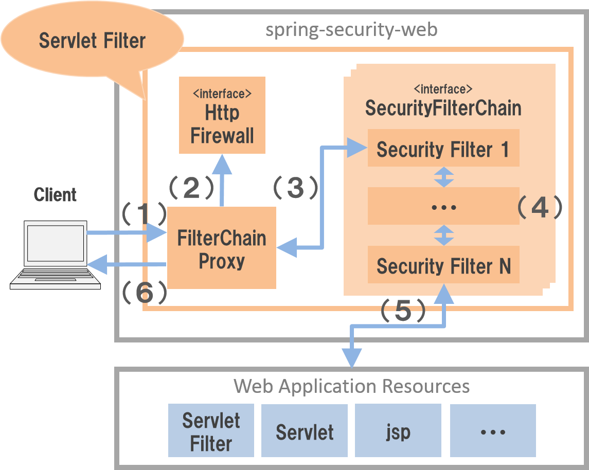

SpringSecurity

# 1. 概要

- SpringFrameworkの一員として提供されている。`org.springframework.boot:spring-boot-starter-security`という依存関係を追加することで適用される
- 提供機能
  - 認証
    - アプリケーションを利用するユーザーの正当性を確認する機能。
  - 認可
    - アプリケーションが提供するリソースや処理に対してアクセスを制御する機能。
  - 他のセキュリティ機能
    - セッション管理機能
    - CSRF   COR
    - セキュリティヘッダ出力機能


# 2. アーキテクチャ



- （２）リクエストUrlは安全かどうかのチェックを行う（デフォルトは`DefaultHttpFirewall`、推薦は`StrictHttpFirewall`）

  `RequestRejectedException`という例外が発生する。

- （３）リクエストUrlによって、初めてマッチングした`SecurityFilterChain`を選べて、その`SecurityFilterChain`の`Filter`を実施する


## 2.1 各種フィルタの機能

- org.springframework.security.web.session.DisableEncodeUrlFilter

  HttpServletResponseを使用したURLのエンコードを無効にする

  URLにセッションIDが含まれる可能性があり、そのままHttpアクセスログに出力すると、セッションIDが漏れる可能性がある。

- org.springframework.security.web.context.request.async.WebAsyncManagerIntegrationFilter

  SecurityContextとWebAsyncManagerを関連するようにする。Callback時SecurityContext関連の処理も呼び出せる

- org.springframework.security.web.context.SecurityContextHolderFilter

  SecurityContextの生成・削除を実施する。（Requestにはマックをつけるのみ、保持はSecurityContextHolderからのStatic関数を利用して取得）

  ログイン済みの場合にはSessionからログイン済み情報をSecurityContextに関連する

- org.springframework.security.web.header.HeaderWriterFilter（★）  Insecure（？）

  HTTPレスポンスヘッダーにセキュリティ関係のものを付与するフィルター(HttpSecurityからカスタマイズ可能)

- org.springframework.web.filter.CorsFilter（★）

  ???????????????????

- org.springframework.security.web.csrf.CsrfFilter（★）

  ???????????????????

- org.springframework.security.web.authentication.logout.LogoutFilter（★）

  ログアウト時動作される（ログイン画面でログアウトボタンが押下される場合）

  セッションから関連認証やcsrf情報をクリアして、ログイン画面にリダイレクトする。

- org.springframework.security.web.authentication.UsernamePasswordAuthenticationFilter（★）

  ログイン画面でログインボタンを押下する際の動作

- org.springframework.security.web.authentication.ui.DefaultLoginPageGeneratingFilter（★）

  `/login`（設定可能）にアクセスやパスワード認証エラーやログアウト成功時のみ当該フィルターが動作される

  ログイン画面のHtml画面を生成して、返す。

- org.springframework.security.web.authentication.ui.DefaultLogoutPageGeneratingFilter（★）

  `/logout`（設定可能）にアクセス時のみ当該フィルターが動作される

  ログアウト画面のHtml画面を生成して、返す。

- org.springframework.security.web.authentication.www.BasicAuthenticationFilter（★）

  ???????????????????

- org.springframework.security.web.savedrequest.RequestCacheAwareFilter

  未ログイン状態でアクセスしてきたユーザに対して、ログイン後、元のリクエストを復元する機能

  RequestCacheの機能により、デフォルトだとHttpSessionにHttpServletRequestの内容が保存されています。

  保存場所はSpringSession機能により切り替えます。

- org.springframework.security.web.servletapi.SecurityContextHolderAwareRequestFilter

  リダイレクトをラップする`SecurityContextHolderAwareRequestWrapper`

- org.springframework.security.web.authentication.AnonymousAuthenticationFilter

  `SecurityContextHolder`に認証情報がないと、匿名の認証情報を作成して`SecurityContextHolder`に格納

- org.springframework.security.web.access.ExceptionTranslationFilter

  https://spring.pleiades.io/spring-security/reference/servlet/architecture.html#servlet-exceptiontranslationfilter

  下りのみ稼働　後続処理から認証・認可に関する例外がThrowされた場合、その例外の内容に応じて処理を行います。

  認証されていない例外の場合はこのフィルターから認証処理を開始する

  認可に関する例外の場合は　AccessDeniedHandlerに処理が異常されます。

  - レスポンスに`Location: http://localhost:8081/login `を付ける

- org.springframework.security.web.access.intercept.AuthorizationFilter

  認可を行う。失敗すると`AccessDeniedException`


## 2.x セキュリティ例外の処理


```java
    @Override
    protected void configure(HttpSecurity http) throws Exception {
        http.headers()
            .addHeaderWriter(new StaticHeadersWriter("x-neko", "nyan"))
    }
```


## 2.3パスワードの生成

```plain
org.springframework.boot.autoconfigure.security.servlet.UserDetailsServiceAutoConfiguration : 

Using generated security password: 14b31fe3-0aef-4441-a977-1bb44cc591fb
```


# 3. 各種セキュリティ対策


# 4. 