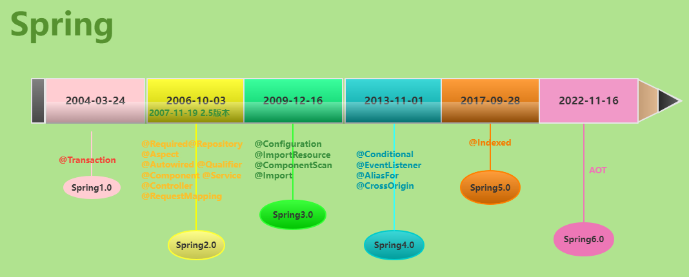

# [Spring boot 3](https://zhuanlan.zhihu.com/p/574267448)

# １ SpringBoot SpringFramework

- SpringFramework歴史

  

- SpringFrameworkとSpringBoot

  


# ２ お主な変更点

## 2.1 依存関係

バージョンアップにより、依存関係のバージョンアップ、メインの変更

- Tomcat：10.1.11　(9系)
- springframework：6.0.11　(5系)
- jakarta.servlet-api：6.0.0　(4系)　（javax.servlet-apiの排除）　　サーブレットバージョン

メリット：Bootの依存関係を利用することで、Java各OSSのバージョン競争などは自分自身で管理しなくてよい。

デメリット：Bootの依存関係対象外のOSSを利用すると、推移依存のバージョンとBootの依存関係のバージョン一致する必要

https://spring.pleiades.io/spring-boot/docs/3.0.6/reference/html/dependency-versions.html#appendix.dependency-versions

## 2.2 JVM

 Java 17必要

SpringBoot 2.7.12：Java 8 

```Java
//
public record Person (String name, String address) {}

//
String textBlock = """
    Hello, this is a
    multi-line
    text block.
""";
  
//
if (obj instanceof String s) {
    System.out.println(s.toLowerCase());
}

//
import javax.servlet.http.HttpServletRequest;
ー＞　import jakarta.servlet.http.HttpServletRequest;

```

## 2.3 コンパイルツール

| ビルドツール | バージョン                |
| :----------- | :------------------------ |
| Maven        | 3.6.3 以上                |
| Gradle       | 7.x (7.5 以降) および 8.x |

## 2.4 AOTサポートの提供

- AOTサポートの提供によって、GraalVMへのサポート

- GraalVMバージョンについて

  | 名前                   | バージョン |
  | :--------------------- | :--------- |
  | GraalVM コミュニティ   | 22.3       |
  | ネイティブビルドツール | 0.9.21     |

## 2.5 Migrating Projects

- 公式サイトのマイグレーションガイド

  https://github.com/spring-projects/spring-boot/wiki/Spring-Boot-3.0-Migration-Guide

- マイグレーションのプログラム

  https://github.com/spring-projects-experimental/spring-boot-migrator

  だた、Mavenのみサポートしている。

- 汎用的な変換OSS：openrewrite

  https://docs.openrewrite.org/

## 2.6 OpenTelemetryのサポート 

- io.opentelemetry関連の依存追加

  ```
  implementation 'io.opentelemetry:opentelemetry-api'
  ・・・
  implementation 'io.opentelemetry:opentelemetry-exporter-logging-otlp'
  ```

- AutoConfigの追加

  ```
  org.springframework.boot.actuate.autoconfigure.tracing.OpenTelemetryAutoConfiguration
  org.springframework.boot.actuate.autoconfigure.tracing.otlp.OtlpAutoConfiguration
  org.springframework.boot.actuate.autoconfigure.metrics.export.otlp.OtlpMetricsExportAutoConfiguration
  ```

- SpringBoot 3.0で追加した機能であり、どんどん機能を追加している

  https://github.com/spring-projects/spring-boot/issues/37278

## 2.7 Observationのサポート 

- io.micrometer関連の依存追加

  ```
  implementation 'io.micrometer:micrometer-observation' 
  ```

- ```Java
  @Component
  public class MyCustomObservation {
  
      private final ObservationRegistry observationRegistry;
  
      public MyCustomObservation(ObservationRegistry observationRegistry) {
          this.observationRegistry = observationRegistry;
      }
  
      public void doSomething() {
          Observation.createNotStarted("doSomething", this.observationRegistry)
              .lowCardinalityKeyValue("locale", "en-US")
              .highCardinalityKeyValue("userId", "42")
              .observe(() -> {
                  // Execute business logic here
              });
      }
  }
  ```

- ObservationHandler

  ```Java
  @Component
  class MyHandler implements ObservationHandler<Observation.Context> {
  
      private static final Logger log = LoggerFactory.getLogger(MyHandler.class);
  
      @Override
      public void onStart(Observation.Context context) {
          log.info("Before running the observation for context [{}], userType [{}]", context.getName(), getUserTypeFromContext(context));
      }
  
      @Override
      public void onStop(Observation.Context context) {
          log.info("After running the observation for context [{}], userType [{}]", context.getName(), getUserTypeFromContext(context));
      }
  
      @Override
      public boolean supportsContext(Observation.Context context) {
          return true;
      }
  
      private String getUserTypeFromContext(Observation.Context context) {
          return StreamSupport.stream(context.getLowCardinalityKeyValues().spliterator(), false)
                  .filter(keyValue -> "userType".equals(keyValue.getKey()))
                  .map(KeyValue::getValue)
                  .findFirst()
                  .orElse("UNKNOWN");
      }
  }
  ```

# 3 GraalVM ネイティブイメージのサポート
## 3.1 GraalVMというのは

- GraalVM：Oracle によって開発された Java 仮想マシンの1つで、Java や Kotlin、Scala などの様々な言語の実行や、ネイティブバイナリへの変換が可能なマルチ言語ランタイム環境です。

  


- GraalVM Native Image：OSから直接できるネイティブバイナリ
- AOT(ahead of time)とJIT(just in time)の区別
  - アプリケーションの静的分析は、ビルド時に `main` エントリポイントから実行される。
  - ネイティブイメージの作成時に到達できないコードは削除され、実行可能ファイルの一部にはない。
  - GraalVM はコードの動的要素を直接認識しないため、リフレクション、リソース、直列化、動的プロキシについて通知する必要がある。
  - アプリケーションのクラスパスはビルド時に固定され、変更できない。
  - 遅延クラスの読み込みはない。実行可能ファイルに同梱されているものはすべて、起動時にメモリに読み込まれます。
  - GraalVM ネイティブイメージは進化するテクノロジーであり、すべてのライブラリがサポートを提供するわけではないので、JITで正常に動作するがAOTでは動作できない可能がある。


## 3.2 SpringBootとGraalVM

- GraalVM対応するためため、spring-coreに`org.springframework.aot`パッケージを追加して、AOTコンパイルためにの大量なカスタマイズ操作ポイントを設けている。

  ```java
  RuntimeHintsRegistrar
  BeanRegistrationAotProcessor
  BeanFactoryInitializationAotProcessor
  ```

- `org.graalvm.buildtools.native`のgradleプラグインを利用することで

  - `build\generated\aotSources\com\example`では`DemoApplication__BeanFactoryRegistrations.java`というプロジェクトに必要なBean定義JavaConfigが生成されている
  - ScanやAutoConfigより生成するBeanは全部抽出できる

- 実際のコンパイル

  ```bash
  F:\VSWorkSpace\000-SpringBoot3.0\springboot3\01-Graalvm-project>java --version
  openjdk 17.0.8 2023-07-18
  OpenJDK Runtime Environment GraalVM CE 17.0.8+7.1 (build 17.0.8+7-jvmci-23.0-b15)
  OpenJDK 64-Bit Server VM GraalVM CE 17.0.8+7.1 (build 17.0.8+7-jvmci-23.0-b15, mixed mode, sharing)
  
  F:\VSWorkSpace\000-SpringBoot3.0\springboot3\01-Graalvm-project>gradle nativeCompile
  
  > Task :processAot
  
    .   ____          _            __ _ _
   /\\ / ___'_ __ _ _(_)_ __  __ _ \ \ \ \
  ( ( )\___ | '_ | '_| | '_ \/ _` | \ \ \ \
   \\/  ___)| |_)| | | | | || (_| |  ) ) ) )
    '  |____| .__|_| |_|_| |_\__, | / / / /
   =========|_|==============|___/=/_/_/_/
   :: Spring Boot ::                (v3.0.6)
  
  2023-10-22T10:20:02.926+09:00  INFO 18480 --- [           main] com.example.DemoApplication              : Starting DemoApplication using Java 17.0.8 with PID 18480 (F:\VSWorkSpace\000-SpringBoot3.0\springboot3\01-Graalvm-project\build\classes\java\main started by rameesky in F:\VSWorkSpace\000-SpringBoot3.0\springboot3\01-Graalvm-project)
  2023-10-22T10:20:02.930+09:00  INFO 18480 --- [           main] com.example.DemoApplication              : No active profile set, falling back to 1 default profile: "default"
  2023-10-22T10:20:03.562+09:00  WARN 18480 --- [           main] o.m.s.mapper.ClassPathMapperScanner      : Cannot use both: sqlSessionTemplate and sqlSessionFactory together. sqlSessionFactory is ignored.
  
  > Task :compileAotJava
  ノート:F:\VSWorkSpace\000-SpringBoot3.0\springboot3\01-Graalvm-project\build\generated\aotSources\org\springframework\boot\autoconfigure\web\servlet\WebMvcAutoConfiguration__BeanDefinitions.javaは推奨されないAPIを使用またはオーバ ーライドしています。
  ノート:詳細は、-Xlint:deprecationオプションを指定して再コンパイルしてください。
  
  > Task :generateResourcesConfigFile
  [native-image-plugin] Resources configuration written into F:\VSWorkSpace\000-SpringBoot3.0\springboot3\01-Graalvm-project\build\native\generated\generateResourcesConfigFile\resource-config.json
  
  > Task :nativeCompile
  [native-image-plugin] GraalVM Toolchain detection is disabled
  [native-image-plugin] GraalVM location read from environment variable: JAVA_HOME
  [native-image-plugin] Native Image executable path: D:\Tools-Java\graalvm-community-openjdk-17.0.8+7.1\bin\native-image.cmd
  ========================================================================================================================
  GraalVM Native Image: Generating '01-Graalvm-project' (executable)...
  ========================================================================================================================
  For detailed information and explanations on the build output, visit:
  https://github.com/oracle/graal/blob/master/docs/reference-manual/native-image/BuildOutput.md
  ------------------------------------------------------------------------------------------------------------------------
  Warning: Method com.zaxxer.hikari.HikariConfig.getScheduledExecutorService() not found.
  ・・・
  Warning: Method com.zaxxer.hikari.HikariConfig.setScheduledExecutorService(ScheduledThreadPoolExecutor) not found.
  [1/8] Initializing...                                                                                    (8.5s @ 0.21GB)
   Java version: 17.0.8+7, vendor version: GraalVM CE 17.0.8+7.1
   Graal compiler: optimization level: 2, target machine: x86-64-v3
   C compiler: cl.exe (microsoft, x64, 19.37.32825)
   Garbage collector: Serial GC (max heap size: 80% of RAM)
   1 user-specific feature(s)
   - org.springframework.aot.nativex.feature.PreComputeFieldFeature
  The bundle named: i18n.Parsing, has not been found. If the bundle is part of a module, verify the bundle name is a fully qualified class name. Otherwise verify the bundle path is accessible in the classpath.
  The bundle named: i18n.Scalars, has not been found. If the bundle is part of a module, verify the bundle name is a fully qualified class name. Otherwise verify the bundle path is accessible in the classpath.
  Field org.apache.commons.logging.LogAdapter#log4jSpiPresent set to true at build time
  ・・・
  Field org.springframework.http.converter.support.AllEncompassingFormHttpMessageConverter#jaxb2Present set to false at build time
  [6/8] Compiling methods...    [*****]                                                                   (21.5s @ 2.68GB)build time
  [7/8] Layouting methods...    [***]                                                                      (5.0s @ 4.11GB) at build time
  [8/8] Creating image...       [***]                                                                      (5.5s @ 5.03GB)
    48.70MB (54.55%) for code area:    63,795 compilation units
    40.09MB (44.90%) for image heap:  435,636 objects and 207 resourcesttpMessageConverter#jsonbPresent set to false at build time
   504.06kB ( 0.55%) for other datanverter.support.AllEncompassingFormHttpMessageConverter#kotlinSerializationCborPresent set to false at build time
    89.28MB in totalamework.http.converter.support.AllEncompassingFormHttpMessageConverter#kotlinSerializationJsonPresent set to false at build time
  ------------------------------------------------------------------------------------------------------------------------ent set to false at build time
  Top 10 origins of code area:                                Top 10 object types in image heap:e
    13.84MB java.base                                           10.64MB byte[] for code metadatame
     4.52MB tomcat-embed-core-10.1.8.jar                         4.67MB java.lang.Class false at build time
     4.20MB java.xml                                             4.33MB java.lang.Stringuild time
     2.03MB jackson-databind-2.14.2.jar                          3.83MB byte[] for java.lang.String
     1.82MB thymeleaf-3.1.1.RELEASE.jar                          3.56MB byte[] for general heap data
     1.64MB postgresql-42.5.4.jar                                1.62MB com.oracle.svm.core.hub.DynamicHubCompanion
     1.61MB spring-core-6.0.8.jar                                1.40MB byte[] for embedded resourcesset to false at build time
     1.57MB svm.jar (Native Image)                               1.21MB byte[] for reflection metadatat to false at build time
     1.48MB mybatis-3.5.11.jar                                 885.75kB java.lang.String[]tPropagationPresent set to true at build time
     1.36MB spring-boot-3.0.6.jar                              685.27kB c.o.svm.core.hub.DynamicHub$ReflectionMetadata time
    14.19MB for 101 more packages                                6.42MB for 3605 more object typesime
  ------------------------------------------------------------------------------------------------------------------------ld time
  Recommendations: analysis...  [******]                                                                  (30.3s @ 2.16GB)
   HEAP: Set max heap for improved and more predictable memory usage.
   CPU:  Enable more CPU features with '-march=native' for improved performance.
  ------------------------------------------------------------------------------------------------------------------------
                         6.8s (8.2% of total time) in 107 GCs | Peak RSS: 7.25GB | CPU load: 10.18
  ------------------------------------------------------------------------------------------------------------------------
  Produced artifacts:raries: crypt32, ncrypt, psapi, version, winhttp
   F:\VSWorkSpace\000-SpringBoot3.0\springboot3\01-Graalvm-project\build\native\nativeCompile\01-Graalvm-project.exe (executable)
   F:\VSWorkSpace\000-SpringBoot3.0\springboot3\01-Graalvm-project\build\native\nativeCompile\jaas.dll (jdk_library).89GB)
   F:\VSWorkSpace\000-SpringBoot3.0\springboot3\01-Graalvm-project\build\native\nativeCompile\w2k_lsa_auth.dll (jdk_library)
  ========================================================================================================================
  Finished generating '01-Graalvm-project' in 1m 21s.
  [native-image-plugin] Native Image written to: F:\VSWorkSpace\000-SpringBoot3.0\springboot3\01-Graalvm-project\build\native\nativeCompile
  ```

## 3.3 エラー例

- Visual Studioインストールしていない場合

  ```
  E:\VSWorkSpace\000-springboot3>gradle nativeCompile
  > Task :nativeCompile FAILED
  [native-image-plugin] GraalVM Toolchain detection is disabled
  [native-image-plugin] GraalVM location read from environment variable: JAVA_HOME
  [native-image-plugin] Native Image executable path: D:\Tools-Java\graalvm-openjdk-17.0.8+7.1\bin\native-image.cmd
  Error: Failed to find 'vcvarsall.bat' in a Visual Studio installation.
  Please make sure that Visual Studio 2022 version 17.1.0 or later is installed on your system. You can download it at https://visualstudio.microsoft.com/downloads/. If this error persists, please try and run GraalVM Native Image in an x64 Native Tools Command Prompt or file a ticket.
  ```

- 一部OSSが未対応する場合

   Mytatis
   https://github.com/mybatis/spring-boot-starter/wiki/Quick-Start-for-building-native-image

  ```bash
     .   ____          _            __ _ _
   /\\ / ___'_ __ _ _(_)_ __  __ _ \ \ \ \
  ( ( )\___ | '_ | '_| | '_ \/ _` | \ \ \ \
   \\/  ___)| |_)| | | | | || (_| |  ) ) ) )
    '  |____| .__|_| |_|_| |_\__, | / / / /
   =========|_|==============|___/=/_/_/_/
   :: Spring Boot ::                (v3.1.4)
  
  2023-10-07T08:32:58.543+09:00  INFO 4552 --- [           main] com.example.demo.DemoApplication         : Starting AOT-processed DemoApplication using Java 17.0.8 with PID 4552 (E:\VSWorkSpace\000-springboot3\build\native\nativeCompile\demo.exe started by Administrator in E:\VSWorkSpace\000-springboot3)
  2023-10-07T08:32:58.543+09:00  INFO 4552 --- [           main] com.example.demo.DemoApplication         : No active profile set, falling back to 1 default profile: "default"
  2023-10-07T08:32:58.546+09:00 ERROR 4552 --- [           main] o.s.boot.SpringApplication               : Application run failed
  java.lang.ExceptionInInitializerError: null
          at org.mybatis.spring.mapper.MapperScannerConfigurer.postProcessBeanDefinitionRegistry(MapperScannerConfigurer.java:363) ~[demo.exe:na]
          at org.springframework.context.support.PostProcessorRegistrationDelegate.invokeBeanDefinitionRegistryPostProcessors(PostProcessorRegistrationDelegate.java:344) ~[na:na]
          at org.springframework.context.support.PostProcessorRegistrationDelegate.invokeBeanFactoryPostProcessors(PostProcessorRegistrationDelegate.java:145) ~[na:na]
          at org.springframework.context.support.AbstractApplicationContext.invokeBeanFactoryPostProcessors(AbstractApplicationContext.java:771) ~[demo.exe:6.0.12]
          at org.springframework.context.support.AbstractApplicationContext.refresh(AbstractApplicationContext.java:589) ~[demo.exe:6.0.12]
          at org.springframework.boot.web.servlet.context.ServletWebServerApplicationContext.refresh(ServletWebServerApplicationContext.java:146) ~[demo.exe:3.1.4]
          at org.springframework.boot.SpringApplication.refresh(SpringApplication.java:737) ~[demo.exe:3.1.4]
          at org.springframework.boot.SpringApplication.refreshContext(SpringApplication.java:439) ~[demo.exe:3.1.4]
          at org.springframework.boot.SpringApplication.run(SpringApplication.java:315) ~[demo.exe:3.1.4]
          at org.springframework.boot.SpringApplication.run(SpringApplication.java:1309) ~[demo.exe:3.1.4]
          at org.springframework.boot.SpringApplication.run(SpringApplication.java:1298) ~[demo.exe:3.1.4]
          at com.example.demo.DemoApplication.main(DemoApplication.java:12) ~[demo.exe:na]
  Caused by: org.apache.ibatis.logging.LogException: Error creating logger for logger org.mybatis.spring.mapper.ClassPathMapperScanner.  Cause: java.lang.NullPointerException
          at org.apache.ibatis.logging.LogFactory.getLog(LogFactory.java:54) ~[na:na]
          at org.apache.ibatis.logging.LogFactory.getLog(LogFactory.java:47) ~[na:na]
          at org.mybatis.logging.LoggerFactory.getLogger(LoggerFactory.java:32) ~[na:na]
          at org.mybatis.spring.mapper.ClassPathMapperScanner.<clinit>(ClassPathMapperScanner.java:62) ~[na:na]
          ... 12 common frames omitted
  Caused by: java.lang.NullPointerException: null
          at org.apache.ibatis.logging.LogFactory.getLog(LogFactory.java:52) ~[na:na]
          ... 15 common frames omitted
  ```

## 3.4 参考資料

- Graalvmインストールガイド：https://medium.com/graalvm/using-graalvm-and-native-image-on-windows-10-9954dc071311
- SpringBootのGraalvmガイド：https://spring.pleiades.io/spring-boot/docs/current/reference/html/native-image.html

- Graalvmの紹介：https://www.slideshare.net/tamrin69/getting-started-graalvm

# ４ OpenTelemetry  TODO

## 4.1 定義

OpenTelemetryは、トレース、メトリック、ログなどのテレメトリデータの作成と管理用に設計された、API、SDK、ツール、および統合のセットです。ベンダーに依存しない実装を提供し、選択したバックエンドにテレメトリーデータを送信する方法を標準化することを目的としています。

主な概念：

- Trace: あるリクエストに対するSpanのまとまり   (一連業務を全部追跡ため)

- Span: リクエスト内の各処理の情報（e.g. 処理名、実行時間、ステータスコードなどなど）   (一つサービス内の追跡)

## 4.2 サンプル(boot)

- 依存関係定義

  ```properties
  //  spring-boot-autoconfigureもここから推移依存で追加して、OpenTelemetryのAutoConfigが行わる
  implementation "org.springframework.boot:spring-boot-starter-actuator"
  // サービス間tracing情報連携する役割
  implementation "io.micrometer:micrometer-tracing-bridge-otel"
  // OpenTelemetry形式なデータを取集サーバへ送信する役割
  implementation "io.opentelemetry:opentelemetry-exporter-otlp"
  
  ```

- データ連携サーバの設定

  ```yaml
  management:
    otlp:
      tracing:
        endpoint: http://192.168.56.98:4318/v1/traces
    tracing:
      sampling:
        probability: 1.0
  
  logging:
    pattern:
      level: "%5p [${spring.application.name:},%X{traceId:-},%X{spanId:-}]"
  ```

- 業務処理の作成、これはあんまり意識が必要ない。通信行う度にデータが送信される

- jaegerサーバの起動

  ```bash
  sudo docker run -d --name jaeger \
    -e COLLECTOR_OTLP_ENABLED=true \
    -p 16686:16686 \
    -p 4317:4317 \
    -p 4318:4318 \
    jaegertracing/all-in-one:latest  
  ```

## 4.3 サンプル(javaagent)

- 依存関係の追加

  ```properties
  implementation "io.opentelemetry.instrumentation:opentelemetry-instrumentation-annotations:1.31.0"
  ```

- アプリの設定

  ```Java
  import io.opentelemetry.instrumentation.annotations.WithSpan;
  
  @RestController
  public class PriceController {
  
  	@GetMapping(path = "/price/{id}")
      @WithSpan
      public Price getPrice(@PathVariable("id") long productId) {
          LOGGER.info("Getting Price details for Product Id {}", productId);
          return priceRepository.getPrice(productId);
    }
  }
  ```

- 起動方法

  ```bash
  set JAVA_TOOL_OPTIONS="-javaagent:lib/opentelemetry-javaagent.jar"
  set OTEL_SERVICE_NAME="product-service"
  set OTEL_METRICS_EXPORTER=prometheus
  set OTEL_EXPORTER_PROMETHEUS_PORT=9464
  set OTEL_EXPORTER_PROMETHEUS_HOST=localhost
  set OTEL_EXPORTER_OTLP_ENDPOINT=http://192.168.56.98:4317
  set OTEL_EXPORTER_OTLP_TRACES_ENDPOINT=http://192.168.56.98:4317
  set OTEL_EXPORTER_OTLP_METRICS_ENDPOINT=http://192.168.56.98:4317
  java -jar spring-open-telemetry-1.jar
  
  set JAVA_TOOL_OPTIONS="-javaagent:lib/opentelemetry-javaagent.jar"
  set OTEL_SERVICE_NAME="price-service"
  set OTEL_METRICS_EXPORTER=prometheus
  set OTEL_EXPORTER_PROMETHEUS_PORT=9464
  set OTEL_EXPORTER_PROMETHEUS_HOST=localhost
  set OTEL_EXPORTER_OTLP_ENDPOINT=http://192.168.56.98:4317
  set OTEL_EXPORTER_OTLP_TRACES_ENDPOINT=http://192.168.56.98:4317
  set OTEL_EXPORTER_OTLP_METRICS_ENDPOINT=http://192.168.56.98:4317
  java -jar spring-open-telemetry-2.jar
  ```

  


https://cloud.tencent.com/developer/article/2291988


## 4.4 参考資料

- javaagentを利用する際に、各種Property設定

  https://github.com/open-telemetry/opentelemetry-java/blob/main/sdk-extensions/autoconfigure/README.md

- opentelemetry公式サイトのガイド

  https://opentelemetry.io/docs/instrumentation/java/getting-started/

- SpringBoot trace ガイド

  https://docs.spring.io/spring-boot/docs/current/reference/html/actuator.html#actuator.micrometer-tracing

# ５ Observation

## 4.1 定義

## 4.2 サンプル(Observed )

- @Observed 

  ```java
  @Observed(name = "cityController")
  @Controller
  public class CityController {
  ```

- 結果　http://localhost:7654/actuator/metrics/cityController

  http://localhost:7654/actuator/metricsで一覧を取得できる

  ```json
  {
      "name": "cityController",
      "baseUnit": "seconds",
      "measurements": [
          {
              "statistic": "COUNT",
              "value": 1
          },
          {
              "statistic": "TOTAL_TIME",
              "value": 0.0241112
          },
          {
              "statistic": "MAX",
              "value": 0.0241112
          }
      ],
      "availableTags": [
          {
              "tag": "method",
              "values": [
                  "showCities"
              ]
          },
          {
              "tag": "error",
              "values": [
                  "none"
              ]
          },
          {
              "tag": "class",
              "values": [
                  "com.example.demo.controller.CityController"
              ]
          }
      ]
  }
  ```

  


# ６ graphql


# 99 そのほか　

## 99.1 Bean生成順番

- XMLファイル定義
- Scanより（@Compont）
- JavaConfig (@Config)
- AutoConfig

